# School District Analysis

## Overview of Project
The following project will look to an analysis of funding and standardized testing data from a city school district in order to determine a variety of performance metrics. These metrics will inform discussion and assist in strategic decisions at the school and district level.

### Purpose
The resulting analysis of the school district data will include performance metrics such as ranking top and bottom performance schools, overall passing rates and average scores on standardized math and reading assessments, and performance based on budget, school size, and type of school. In addition, there has been evidence found of academic dishonesty; the ninth grade scores at Thomas High School appear to be altered – the data will need to be reviewed and treated to determine the impact and difference to metrics for all schools in the district.

## Results
The below will provide insight on the impact of the changes in data after all the math and reading grades for the ninth grade at Thomas High School (THS) were replaced by NaNs.

### How is the district summary affected?
#### District Summary
The below illustrates the District Summary before and after the data modifications.

##### *Table 1 – Initial District Summary*
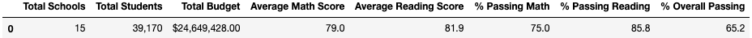

##### *Table 2 – Modified District Summary*
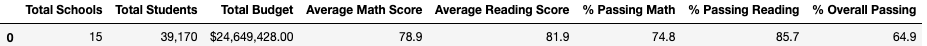

* This city school district includes 15 schools, 39,170 students and an overall budget of $24,649,428.00
* Students in this district tended to score better on Reading standardized tests than Math standardized tests but the average score for both Reading and Math were greater than the passing grade of 70%
* A higher percentage of students tended to pass the Reading standard tests than Math standardized tests
* Despite this, a significantly lower percentage of students passed both standardized tests, further indicating that students might perform better on one subject than another and not well on both as shown by the lower % Overall Passing
* After the modification to the data, the average scores and percentage passing remained the same (after rounding of the decimal) except for the % Overall Passing, which decreased by 0.3% 

### How is the school summary affected?
#### School Summary
The below illustrates the School Summary before and after the data modifications. The details for THS are highlighted and will help to illustrate how replacing the ninth graders’ math and reading scores affected THS’s performance relative to the other schools.

##### *Table 3 – Initial School Summary*
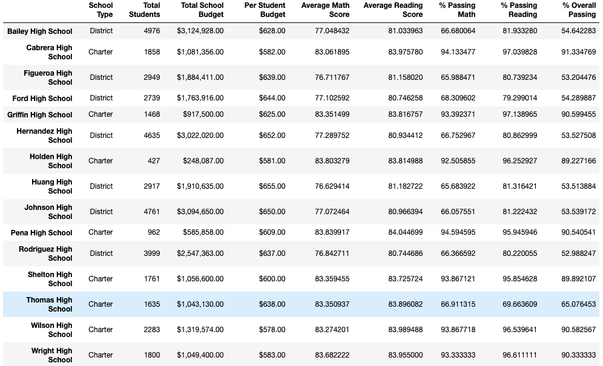

##### *Table 4 – Modified School Summary*
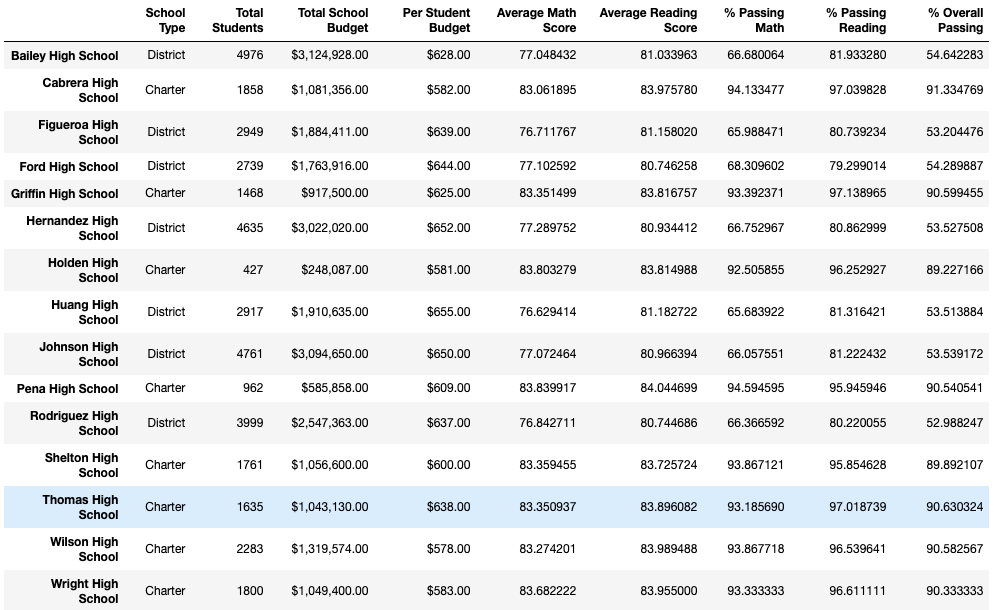

* There are two types of schools, Charter and District
	* Charter schools have a significantly lower number of students, not exceeding 2,500 whereas District schools are significantly higher with an upwards limit of nearly 5,000 students
	* It appears that students from Charter schools perform consistently better on standardized tests for Math and Reading, with the exception of the results from THS as can be seen in Table 3 – as this is an anomaly, it can be inferred that this is due to the impact on the suspected issues with the ninth grade scores from THS
* After the ninth grade scores from THS were replaced with NaNs, the % Passing scores for Math, Reading and Overall saw more than a 25% increase
	* This reinforces the idea that the ninth grade scores were out of the norm for THS and significantly impacted performance at this Charter school
* Since the modification to the data was only applied to the ninth grade scores from THS, there were no impacts to the other schools 

### How does replacing the ninth-grade scores affect the following metrics?
#### Math and Reading Scores by Grade
The below are the Math and Reading scores by grade for each school after replacing the ninth graders’ scores. 

##### *Table 5 & 6 – Math and Reading Scores by Grade (respectively)*

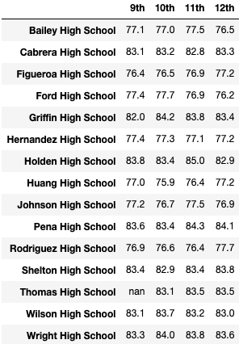 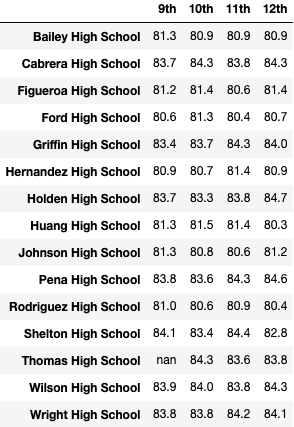

* By replacing the ninth grade scores for THS, the table displays “NaN” with no changes to any other grades or schools

#### Scores by School Spending
The total budgetary spending per student were divided into four spending ranges. By replacing the scores for THS, the data may be more accurate in the $630 – $644 spending range but with no significant before or after change.

##### *Table 7 – Scores by Spending*
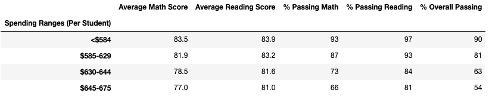

#### Scores by School Size
There were three school sizes in this city school district, Small, Medium and Large. By replacing the scores for THS, the data may be more accurate for Medium sized schools with 1,000 – 2000 students but with no significant before or after change.

##### *Table 8 – Scores by School Size*
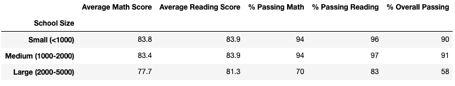

#### Scores by School Type
As previously mentioned, there are two types of schools in this city school district, Charter and District. By replacing the scores for THS, the data may be more but with no significant before or after change.

##### *Table 9 – Scores by School Type*
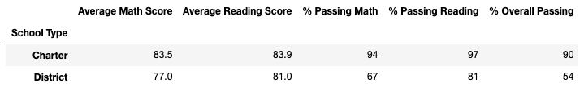

### Top and Bottom Schools
The below are the Top 5 and Bottom 5 schools in the city school district based on % Overall Passing.

##### *Table 10 – Top 5 Schools*
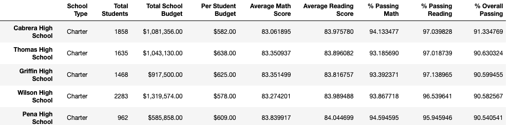

##### *Table 11 – Bottom 5 Schools*
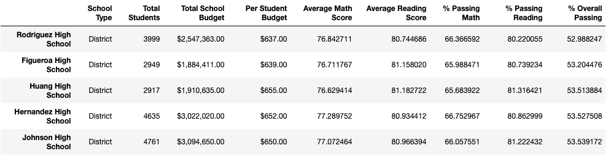

* After replacing the ninth grade scores from THS, THS still remained second in the list of Top 5 schools based on % Overall Passing, despite a slight decrease of 0.3%
* There was no change to the Bottom 5 schools

## Summary
In summary, this project looked to provide an analysis of funding and standardized testing data from a city school district in order to determine a variety of performance metrics, especially after the replacement of ninth grade data from Thomas High School after evidence of academic dishonesty.

The following are four significant points of change:
1. The % Passing Math, % Passing Reading and % Overall Passing increased for Thomas High School
2. All Charter schools performed better on standardized testing than District schools, including Thomas High School
3. Thomas High School remained in the Top 5 schools list since the ninth grade scores were removed – if the grades were included, this may have resulted in a different ranking for Thomas High School
4. The ninth grade scores from Thomas High School were replaced by NaNs and therefore were excluded from the analysis
